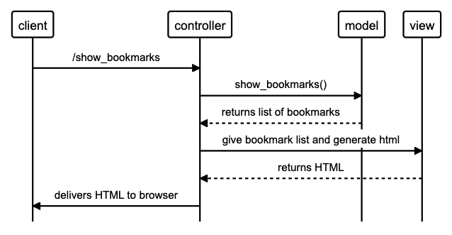

## User Stories

```language
As a busy man-about-town,
So that I may frequent my favourite websites with speed and ease,
I would like to see a list of bookmarks.
```



As a conoseiour of webpages,
So that I can visit my favourite webpages,
I'd like to be able to add new bookmarks.

As a weathered critic of internet pages,
So that I can clear out the poorly-aged websites of my youth,
I'd like to delete bookmarks.

# Database Creation

## 1. connect to psql

```terminal
$> psql
```

## 2. Create database

```postgreSQL
user_name=# CREATE DATABASE bookmark_manager;
```

## 3. Connect to the database

```postgreSQL
user_name=# \c bookmark_manager;
```

## 4. Run Query

```postgreSQL
user_name=# CREATE TABLE bookmarks(id SERIAL PRIMARY KEY, url VARCHAR(60));
```